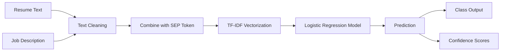

# 📄 Mini ATS – Resume vs Job Description Matcher
An end-to-end Machine Learning system that evaluates the compatibility between a candidate's resume and a job description using NLP and classification techniques.

---

## 🚀 Features
-  Multi-class classification: **Good Fit / Potential Fit / No Fit**
-  TF-IDF based feature extraction
-  Class imbalance handling with weighted Logistic Regression
-  Model evaluation with detailed metrics
-  Explainable predictions with confidence scores
-  Deployed on Streamlit

---

##  Live Demo
👉 [Try it here](https://mini-ats-ewktd95a3zte7mg557utx2.streamlit.app/)

---

## 📊 Model Performance

**Accuracy: 0.5981**

| Class | Precision | Recall | F1-Score | Support |
|---|---|---|---|---|
| Good Fit | 0.54 | 0.78 | 0.64 | 309 |
| No Fit | 0.77 | 0.46 | 0.58 | 629 |
| Potential Fit | 0.50 | 0.69 | 0.58 | 311 |
| **accuracy** | | | **0.60** | 1249 |
| macro avg | 0.60 | 0.64 | 0.60 | 1249 |
| weighted avg | 0.65 | 0.60 | 0.59 | 1249 |

📌 **Note:** Higher recall for **Good Fit** and **Potential Fit** improves real-world ATS usefulness. Slight trade-off in overall accuracy due to class balancing.

---

## 📚 Dataset
Trained on:
👉 [cnamuangtoun/resume-job-description-fit](https://huggingface.co/datasets/cnamuangtoun/resume-job-description-fit)
- Contains resume–job description pairs
- Labels: `Good Fit`, `Potential Fit`, `No Fit`
- ~6K samples

---

## 🧠 ML Pipeline



---

## ⚙️ Tech Stack
- Python
- scikit-learn
- TF-IDF (NLP)
- Logistic Regression
- Streamlit
- Hugging Face Datasets

---

## 💡 Example Output
```
Prediction: Potential Fit
Confidence:
  Good Fit:      0.29
  No Fit:        0.33
  Potential Fit: 0.38
```
```
